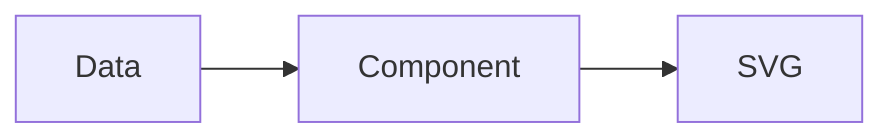

# Getting Started

See the [sszvis package on npm](https://www.npmjs.com/package/sszvis) for release history.

## Installation

```bash
pnpm add sszvis d3
```

## Usage

```html
<link href="https://unpkg.com/sszvis@3/build/sszvis.css" rel="stylesheet" />
<div id="sszvis-chart" style="margin: 0; padding: 0"></div>
```

```js
function parseRow(d) {
  return {
    date: sszvis.parseDate(d["Datum"]),
    category: d["Berufsfeld"],
    value: sszvis.parseNumber(d["Anzahl"]),
  };
}

// Fetch the CSV and render once it resolves
var config = { fallback: "fallback.png", ticks: 5 };
d3.csv("path/to/data.csv", parseRow).then(render).catch(sszvis.loadError);
```

## Diagrams

Mermaid blocks render inline:


